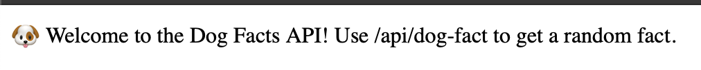
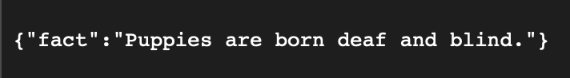
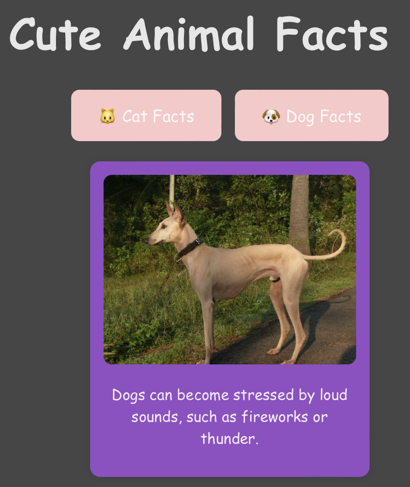
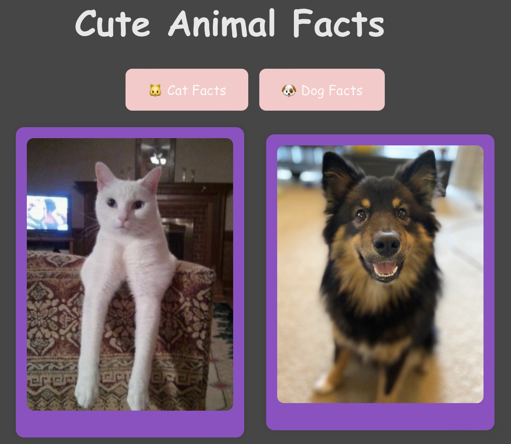

# 🐾 Cute Animal Facts

Welcome to **Cute Animal Facts** – a web app that serves up random fun facts and adorable images of cats and dogs! 🐱🐶 This project combines a React frontend with a custom Express API backend (for dog facts) and fetches images from public APIs to give users a dose of cuteness on demand.

## 🌟 Features

- 🐱 Random cat facts from [catfact.ninja](https://catfact.ninja)
- 🐶 Custom-built Express API serving dog facts
- 🖼️ Cute images from [TheCatAPI](https://thecatapi.com) and [Dog CEO API](https://dog.ceo)
- 🎨 Responsive design with toggle buttons to switch between animal types

## 📦 Tech Stack

- **Frontend**: React (Vite), CSS
- **Backend**: Node.js + Express (dog facts API)
- **Hosting**: Netlify (frontend), Render (API)
- **Version Control**: Git + GitHub

## 🚀 Live Demo

- 🌐 Frontend (Netlify): [https://cute-animals-ta.netlify.app](https://cute-animals-ta.netlify.app)
- 🐶 Dog Facts API (Render): [https://dog-facts-api.onrender.com/api/dog-fact](https://dog-facts-api.onrender.com/api/dog-fact)

- Screenshots:





## 📁 Project Structure

cute-animal-facts-full/

├── client/ # React frontend

├── server/ # Express backend (dog facts)

└── README.md

## 🛠️ Running Locally

1. Clone the repo:
   ```bash
   git clone https://github.com/yourusername/cute-animal-facts-full.git
   cd cute-animal-facts-full
   ```
2. Start the backend:
 ```bash
  cd server
  npm install
  node index.js
```
3. Start the frontend in a new terminal tab:
 ```bash
   cd ../client
  npm install
  npm run dev
```

Visit http://localhost:5173 to use the app locally.

## ✨ Credits

Cat facts from catfact.ninja
Dog images from dog.ceo
Cat images from thecatapi.com
Dog facts from a custom Express API

